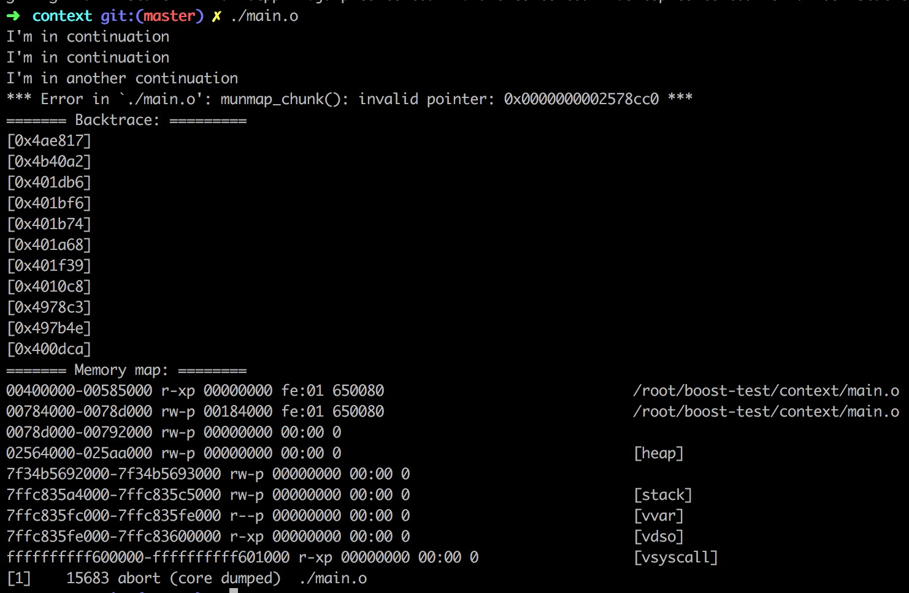
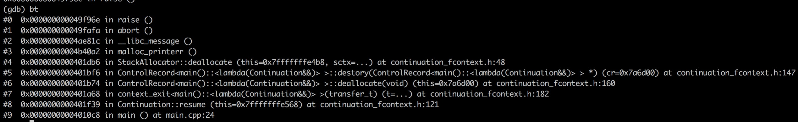

# 现在的成果 #


`jump_fcontext`／`make_fcontext`／`ontop_fcontext`分别是用汇编写的，分别在三个文件中

（特别是`jump_fcontext`，我们看过objdump反汇编出来的汇编代码，应该不会很陌生）

但：看汇编和写汇编是两码事（很多细节在自己写的时候根本注意不到），所以我选择了“抄袭”

```shell
git clone https://github.com/boostorg/context.git
cd ~/context/src/asm
```


特别地，说明一下：

+ S／asm分别对应着Linux平台与Windows平台的汇编文件后缀
+ gas是Linux平台下的标准汇编器，masm是Windows平台下的汇编器
+ elf／mach-o／PE分别是Linux／Mac／Windows平台下的二进制文件格式
+ aapcs: Procedure Call Stanard for the ARM Architecture
+ arm64／arm／i386／mipc32／ppc32／x86_64／……分别是CPU架构

总体来说，（不同的操作系统 + 不同的指令集）会对应不同的汇编代码

把常用的x86-64架构对应的汇编代码选出来即可

continuation_fcontext.h是主要代码所在文件

# 解决Bug #

## 什么Bug ##




## 修复Bug ##



初步判断是对同一块内存的两次释放导致的问题


用valgrind也没有什么特别的收获，也只不过得到了调用栈

