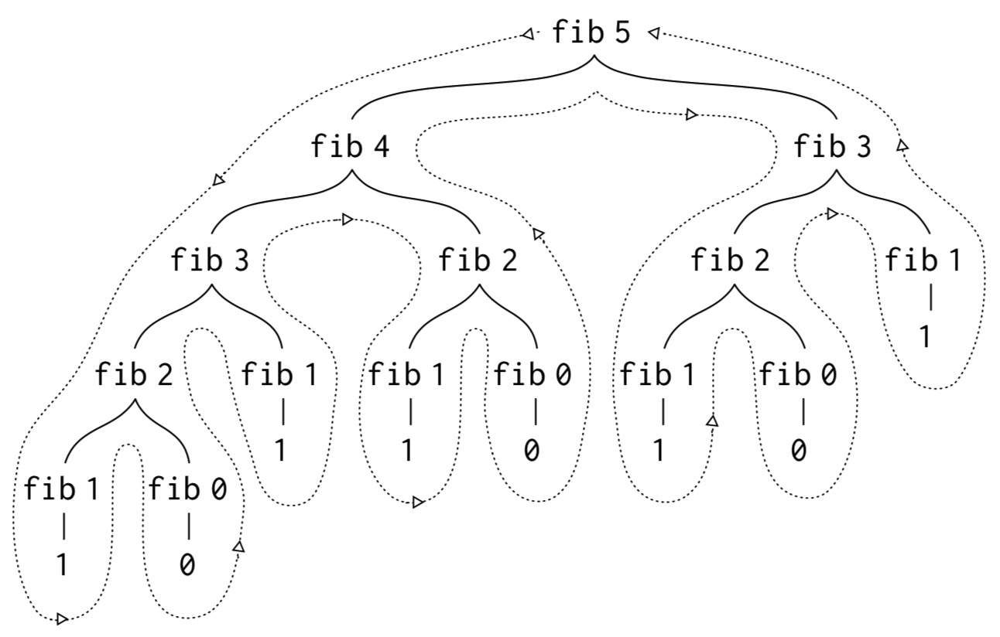

# 1. Building Abstractions with Procedures #

computational process / data / program

program 是进程演进规则的集合

Recursive Functions of Symbolic Expressions and eir Computation by Machine

Lisp dislect -> Scheme

Procedures can themselves be represented and manipulated as Lisp Data. The importance of this is that there are powerful program-design techniques that rely on the ability to blur the traditional distinction between "passive" data and "active" processes.

## 1.1 The Elements of Programming ##

### 1.1.1 Expressions ###

primitive expressions / means of combination / means of abstraction

means of abstraction can name and manipulate compound elements as units.

Expressions formed by delimiting a list of expressions within parentheses in order to denote procedure application, are called combinations.

```scheme
(+ (* 3
      (+ (* 2 4)
         (+ 3 5)))
   (+ (- 10 7)
      6))
```

### 1.1.2 Naming and the Environment ###

```scheme
(define size 2)
```

define is our language’s simplest means of abstraction.

name-object associations

global environment

### 1.1.3 Evaluating Combinations ###

tree accumulation

numerals / built-in operators / objects

symbols such as + and * are associated with the sequences of machine instructions that are their "values".

The role of the environment in determine the meaning of the symbols in expressions.

The evaluation rule given above does not handle definitions. For instance, evaluating (define x 3) does not apply define to two arguments. 

> define 在 lambda 演算里具有一种很特殊的定义——替换？

Such exceptions to the general evaluation rule are called special forms. Each special form has its own evaluation rule. The various kinds of expressions (each with its associated evaluation rule) constitute the syntax of the programming language.

> special forms = the rules of lambda calculation ?
>
> special forms = BNF ?

### 1.1.4 Compound Procedures ###

abstraction technique: the associated names / procedure definitions

```scheme
(define (square x) (* x x))
```

```BNF
<definition> ::= (define <call pattern> <body>)
<call pattern> ::= (<pattern> <variable>*) | (<pattern> <variable>* . <variable>)
```

### 1.1.5 The Substitution Model for Procedure Application ###

To apply a compound procedure to arguments, evaluate the body of the procedure with each formal parameter replaced by the corresponding argument.

> alpha-conversion / beta-reduction / eta-conversion

+ alpha-conversion

  + alpha-conversion allows bound variable names to be changed. For example, alpha-conversion of $\lambda x . x$might yield $\lambda y . y$. Terms that differ only by alpha-conversion are called $\alpha$-equivalent.

  + The precise rules for alpha-conversion are not completely trivial. First, when alpha-converting an abstraction, the only variable occurrences that are renamed are those that are bound to the same abstraction. For example, an alpha-conversion of $\lambda x . \lambda x . x$ could result in $\lambda x . \lambda y . y$, but it could not result in $\lambda y . \lambda x . y$. The latter has a different meaning from the original. This is analogous to the programming notion of variable shadowing.

  + Second, alpha-conversion is not possible if it would result in a variable getting captured by a different abstraction. For example, if we replace $x$ with $y$  in $\lambda x . \lambda y . x$, we get $\lambda y . \lambda y . y$, which is not at all the same.

  + Substitution, written $E[ V := R ]$, is the process of replacing all free occurrences of the variable $V$ in the expression $E$ with expression $R$. Substitution on terms of the lambda-calculus is defined by recursion on the structure of terms, as follows (note: $x$ and $y$ are only variables while $M$ and $N$ are any lambda expression).
    $$
    \begin{align*}
    x[x := N] &= N \\
    y[x := N] &= y, if x \neq y \\
    (M1 \ M2)[x := N]	&= (M1[x := N]) (M2[x := N]) \\
    (\lambda x . M)[x := N] &= \lambda x . M \\
    (\lambda y . M)[x := N] &= \lambda y . (M[x := N]), if x \neq y, provided y \not\in FV(N) \\
    \end{align*}
    $$

  + 替换一定要注意避免 bound variable

+ Beta-reduction captures the idea of function application. Beta-reduction is defined in terms of substitution: the beta-reduction of $((\lambda V . E) E ')$ is $E [V := E']$. For example: $((\lambda n . n * 2) \ 7)$ -> $7 * 2$.

+ Eta-conversion expresses the idea of extensionality, which in this context is that two functions are the same if and only if they give the same result for all arguments. Eta-conversion converts between $\lambda x . f x$ and $f$ whenever $x$ does not appear free in $f$.

In particular, when we address in Chapter 3 the use of procedures with "mutable data", we will see that the substitution model breaks down and must be replaced by a more complicated model of procedure application.

> lambda calculus doesn't support mutable data?

Applicative order versus normal order = eager versus lazy

### 1.1.6 Conditional Expressions and Predicates ###

```scheme
(define (abs x)
  (cond ((> x 0) x)
        ((= x 0) 0)
        (else - x)))
```

predicate / clause

and / or / not

If none of the predicate's is found to be true, the value of the cond is undefined.

#### Exercise 1.1 ####

|                      expression                      |          output          |
| :--------------------------------------------------: | :----------------------: |
|                     (define a 3)                     | not an expression, a = 3 |
|                  (define b (+ a 1))                  | not an expression, b = 4 |
|         (if (and (> b a) (< b (* a b))) b a)         |            4             |
|   (cond ((= a 4) 6) ((= b 4) (+ 6 7 a)) (else 25))   |            16            |
|                (+ 2 (if (> b a) b a))                |            6             |
| (* (cond ((> a b) a) ((< a b) b) (else -1)) (+ a 1)) |            16            |

#### Exercise 1.2 ####

$$
\frac{5 + 4 + (2 - (3 - (6 + \frac{4}{5}))}{3(6-2)(2-7)}
$$

```scheme
(define frac (
  / (+ 5 4
       (- 2
          (- 3
             (+ 6
                (/ 4 5)))))
    (* 3
       (- 6 2)
       (- 2 7))))
```

#### Exercise 1.3 ####

Define a procedure that takes three numbers as arguments and returns the sum of the squares of the two larger numbers.

```scheme
(define (>= a b) (or (> a b) (= a b)))
(define (f a b c)
  (cond ((and (>= a b) (>= b c)) (+ (* a a) (* b b)))
        ((and (>= a b) (>= c b)) (+ (* a a) (* c c)))
        ((and (>= b a) (>= a c)) (+ (* b b) (* a a)))
        ((and (>= b a) (>= c a)) (+ (* b b) (* c c)))))
```

#### Exercise 1.4 ####

Observe that our model of evaluation allows for combinations whose operators are compound expressions. Use this observation to describe the behavior of the following procedure:

```scheme
(define (a-plus-abs-b a b)
  ((if (> b 0) + -) a b))
```

`(if (> b 0) + -)` is an expression whose value is a procedure.

a-plus-abs-b = $\lambda a . \lambda b . a + {\lvert}b{\rvert}$

#### Exercise 1.5 ####

Ben Bitdiddle has invented a test to determine whether the interpreter he is faced with is using applicative order evaluation or normal-order evaluation. He defines the following two procedures:

```scheme
(define (p) (p))
(define (test x y)
  (if (= x 0) 0 y))
```

Then he evaluates the expression `(test 0 (p))`

What behavior will Ben observe with an interpreter that uses applicative-order evaluation? What behavior will he observe with an interpreter that uses normal-order evaluation?

In eager evaluation (applicative-order evaluation):
$$
\begin{align*}
\lambda . test \ 0 \ p &= \lambda . test \ 0 \ (\lambda . p) \\
&= \lambda . test \ 0 \ (\lambda . (\lambda . p)) \\
&= \lambda . test \ 0 \ (\lambda . (\lambda . (\lambda . p))) \\
&= \ ...
\end{align*}
$$
In lazy evaluation (normal-order evaluation):
$$
\begin{align*}
\lambda . test \ 0 \ p &= (if (= \ x \ 0) \ 0 \ y))[x := 0, y := p] \\
&= (if (= \ 0 \ 0) \ 0 \ p) \\
&= 0
\end{align*}
$$

### 1.1.7 Example: Square Roots by Newton’s Method ###

$\sqrt{x}$ = the $y$ such that $y \nless 0$ and $y^2 = x$

The contrast between function and procedure is a reflection of the general distinction between describing properties of things and describing how to do things, or, as it is sometimes referred to, the distinction between declarative knowledge and imperative knowledge.

>命令式语言 vs 声明式语言

```scheme
(define (sqrt x)
  (the y (and (>= y 0)
              (= (square y) x))))
```

```scheme
(define (square x) (* x  x))
(define (good-enough? guess x)
  (< (abs (- (square guess) x)) 0.001))
(define (average x y)
  (/ (+ x y) 2))
(define (improve guess x)
  (average guess (/ x guess)))
(define (sqrt-iter guess x)
  (if (good-enough? guess x)
      guess
      (sqrt-iter (improve guess x) x)))
(define (sqrt x)
  (sqrt-iter 1.0 x))
```

#### Exercise 1.6 ####

Alyssa P. Hacker doesn’t see why if needs to be provided as a special form. “Why can’t I just define it as an ordinary procedure in terms of cond?” she asks. Alyssa’s friend Eva Lu Ator claims this can indeed be done, and she defines a new version of if:

```scheme
(define (new-if predicate then-clause else-clause)
  (cond (predicate then-clause)
        (else else-clause)))
```

Delighted, Alyssa uses new-if to rewrite the square-root program:

```scheme
(define (sqrt-iter guess x)
  (new-if (good-enough? guess x)
          guess
          (sqrt-iter (improve guess x) x)))
```

What happens when Alyssa aempts to use this to compute square roots?

发生不必要的计算，if-statement 应该是类似于短路表达式，经过编译器特殊优化

#### Exercise 1.7 ####

The good-enough? test used in computing square roots will not be very effective for finding the square roots of very small numbers. Also, in real computers, arithmetic operations are almost always performed with limited precision. This makes our test inadequate for very large numbers. Explain these statements, with examples showing how the test fails for small and large numbers. An alternative strategy for implementing good-enough? is to watch how guess changes from one iteration to the next and to stop when the change is a very small fraction of the guess. Design a square-root procedure that uses this kind of end test. Does this work better for small and large numbers?

对于较小的数，0.001 的误差是不可忽略的

```scheme
(define (error x)
  (/ (- (square (sqrt x))
        x)
     x))
(error 9)
(error 1e-16)
```

```scheme
(define (square x) (* x  x))
(define (average x y)
  (/ (+ x y) 2))
(define (improve guess x)
  (average guess (/ x guess)))
(define (good-enough? guess x)
  (< (abs (- (abs (- (square guess)
                     x))
             (abs (- (square (improve guess x))
                     x))))
     0.001))
(define (sqrt-iter guess x)
  (if (good-enough? guess x)
      guess
      (sqrt-iter (improve guess x) x)))
(define (sqrt x)
  (sqrt-iter 1.0 x))
```

```scheme
(define (error x)
  (/ (- (square (sqrt x))
        x)
     x))
(error 9)
(error 1e-16)
(error 1e30)
```

新 good-enough? 函数对于 sqrt 的精度在小数计算方面没有提升，但在大数计算方面有提升

#### Exercise 1.8 ####

Newton’s method for cube roots is based on the fact that if $y$ is an approximation to the cube root of $x$ , then a better approximation is given by the value $\frac{\frac{x}{y^2} + 2y}{3}$. Use this formula to implement a cube-root procedure analogous to the square-root procedure.

```scheme
(define (square x) (* x  x))
(define (good-enough? guess x)
  (< (abs (- (square guess) x)) 0.001))
(define (average x y)
  (/ (+ x y) 2))
(define (improve guess x)
  (/ (+ (/ x (* guess guess))
        (* 2 guess))
     3))
(define (sqrt-iter guess x)
  (if (good-enough? guess x)
      guess
      (sqrt-iter (improve guess x) x)))
(define (sqrt x)
  (sqrt-iter 1.0 x))
```

Not stop when running `(sqrt 5)`. Why?

### 1.1.8 Procedures as Black-Box Abstractions ###

#### Y-combinator ####

The idea of being able to define a procedure in terms of itself may be disturbing; it may seem unclear how such a "circular" definition could make sense at all.

In computer science's combinatory logic, a fixed-point combinator is a higher-order function `fix` that, for any function f that has an attractive fixed point, returns a fixed point x of that function.

```scheme
(define (fix f) (the-fixed-point of f))
```

$$
\begin{align*}
x &= f \ x \\
fix \ f &= x = f \ x = f (fix \ f) \\
fix \ f &= f (fix \ f) \\
fix \ f &= f (f (... f(fix \ f) ...))
\end{align*}
$$

A particular implementation of `fix` is Curry's paradoxical combinator `Y`, represented in lambda calculus by $Y = \lambda f .(\lambda x.f(x \ x))(\lambda x. f(x \ x))$.
$$
\begin{align*}
Y g &= (\lambda f . (\lambda x . f (x \ x))(\lambda x . f(x \ x))) g \\
&= (\lambda x . f (x \ x))(\lambda x . f(x \ x))[f := g] \\
&= (\lambda x . g (x \ x))(\lambda x . g(x \ x)) \\
&= (\lambda x . g (x \ x))((\lambda x . g(x \ x))[x := y]) \\
&= (\lambda x . g (x \ x))(\lambda y . g(y \ y)) \\
&= (g (x \ x))[x := \lambda y . g (y \ y)] \\
&= g (\lambda y . g(y \ y)) (\lambda y . g(y \ y)) \\
&= g (\lambda y . g(y \ y))[y := x] (\lambda y . g(y \ y))[y := x] \\
&= g (\lambda x . g(x \ x)) (\lambda x . g(x \ x)) \\
&= g (Y g)
\end{align*}
$$
In functional programming, the `Y` combinator can be used to formally define recursive functions in a programming language that does not support recursion.

```scheme
(define f-whose-fixed-point-is-factorial
  (lambda (r)
    (lambda (x)
      (if (= x 1) 1 (* x
                       (r (- x 1)))))))
```

```scheme
(define g-loop-forever
  (lambda (f)
    (lambda (x) (f (x x)))))
(define fix-loop-forever
  (lambda (f)
    ((g-loop-forever f) (g-loop-forever f))))
(fix-loop-forever f-whose-fixed-point-is-factorial)

(define g-not-loop-forever
  (lambda (f)
    (lambda (x)
      (f (lambda (a) ((x x) a))))))
(define fix-not-loop-forever
  (lambda (f)
    ((g-not-loop-forever f) (g-not-loop-forever f))))
((fix-not-loop-forever f-whose-fixed-point-is-factorial) 10)

(define Y
  (lambda (f)
    ((lambda (g) (g g))
     (lambda (x)
       (f (lambda a (apply (x x) a)))))))
((Y f-whose-fixed-point-is-factorial) 10)
```

暂且不清楚 g-loop-forever 为什么会导致死循环？这也许和 Y-combinator 能够无限展开是有关系的

Y-combinator 可以将递归函数解释成语法糖：f = Y F

#### Local names ####

So a procedure definition should be able to suppress detail.

A formal parameter of a procedure is a bound variable (a local name). If a variable is not bound, we say
that it is free. The meaning of a procedure definition is unchanged if a bound variable is consistently renamed throughout the definition.

```scheme
(define (good-enough? guess x)
  (< (abs (- (square guess) x))
     0.001))
```

In the definition of good-enough? above, guess and x are bound variables but <, -, abs, and square are free. If we renamed guess to abs we would have introduced a bug by capturing the variable abs. It would have changed from free to bound.

> 1. 讨论 free / bound 时需要指定表达式
> 2. 从 free 到 bound 类似于命令式编程中的 shadowing

#### Internal definitions and block structure ####

```scheme
(define (fix-not-loop-forever)
  (define g-not-loop-forever
    (lambda (f)
      (lambda (x)
        (f (lambda (a) ((x x) a))))))
  (lambda (f)
    ((g-not-loop-forever f) (g-not-loop-forever f))))
(define f-whose-fixed-point-is-factorial
  (lambda (r)
    (lambda (x)
      (if (= x 1) 1 (* x
                       (r (- x 1)))))))
(((fix-not-loop-forever) f-whose-fixed-point-is-factorial) 10)
```

the simplest name-packaging problem

lexical scoping

> 一个变量在内部表达式看来是 free ，在外部表达式看来是 bound

## 1.2 Procedures and the Processes They Generate ##

A procedure is a pattern for the local evolution of a computational process. It specifies how each stage of the process is built upon the previous stage.

> 不妨将 statement 认为是 stage

### 1.2.1 Linear Recursion and Iteration ###

```scheme
(define (factorial n) (if (= n 1)
                          1
                          (* n (factorial (- n 1)))))
```

$$
\begin{align*}
(factorial 6) &= (* \ 6 \ (factorial \ 5)) \\
&= (* \ 6 \ (* \ 5 \ (* \ 4 \ (* \ 3 \ (* \ 2 \ (factorial \ 1)))))) \\
&= (* \ 6 \ 120) \\
\end{align*}
$$

expansion = a chain of deferred operations

expansion / contraction

This type of process, characterized by a chain of deferred operations, is called a recursive process. Carrying out this process requires that the interpreter keep track of the operations to be performed later on.

```scheme
(define (factorial n) (fact-iter 1 1 n))
(define (fact-iter product counter max-count)
  (if (> counter max-count)
      product
      (fact-iter (* counter product)
                 (+ counter 1)
                 max-count)))
```

> tail recursion = iterative process ?

"hidden" information

recursive process versus recursive procedure

#### Exercise 1.9 ####

Are these processes iterative or recursive?

```scheme
(define (+ a b)
  (if (= a 0) b (inc (+ (dec a) b))))
(define (+ a b)
  (if (= a 0) b (+ (dec a) (inc b))))
```

recursive / iterative

#### Exercise 1.10 ####

The following procedure computes a mathematical function called Ackermann’s function.

```scheme
(define (A x y)
  (cond ((= y 0) 0)
        ((= x 0) (* 2 y))
        ((= y 1) 2)
        (else (A (- x 1) (A x (- y 1))))))
```

What are the values of the following expressions?

| expression | result |
| :--------: | :----: |
|  (A 1 10)  |  1024  |
|  (A 2 4)   | 65536  |
|  (A 3 3)   | 65536  |

|       expression       |      result      |
| :--------------------: | :--------------: |
| (define (f n) (A 0 n)) |       $2n$       |
| (define (g n) (A 1 n)) |      $2^n$       |
| (define (h n) (A 2 n)) | $$2 \uparrow n$$ |

### 1.2.2 Tree Recursion ###



```scheme
(define (count-change-helper amount changes count)
  (define (tail l) (list-tail l 1))
  (define (head l) (list-ref l 0))
  (define (empty l) (= (length l) 0))
  (define (p1) (count-change-helper (- amount (* count (head changes)))
                                    (tail changes)
                                    0))
  (define (p2) (count-change-helper amount
                                    changes
                                    (+ count 1)))
  (cond ((< amount 0) 0)
        ((= amount 0) 1)
        ((> amount 0) (cond ((empty changes) 0)
                            (else (cond ((> amount (* (head changes) count))
                                         (+ (p1) (p2)))
                                        ((= amount (* (head changes) count))
                                         (+ (p1) 0)) ;(p1))
                                        (else 0)))))))
(define (count-change amount) (count-change-helper amount (list 50 25 10 5 1) 0))
(count-change 100)
; 用 50 / 25 / 10 / 5 / 1 一共有多少种方法组成组成 100 ？
```

On the other hand, it is not obvious how to design a better algorithm for computing the result, and we leave this problem as a challenge.

> 从斐波那契函数的普通递归版本和尾递归版本中可以找到一些 insight
>
> 斐波那契数函数不会无限递归是因为 n 每次都至少减一，而 1 / 2 为终止条件
>
> count-change-helper 不会无限递归是因为 amount 每次至少减一或者 changes 的长度每次至少减一
>
> 同时表达两个变量的“衰减”是一件很困难的事情

```scheme
(define (count-change-helper index method amount money stack)
  (define (zeros len)
    (if (= len 0)
        (list)
        (cons 0 (zeros (- len 1)))))
  (define (cleanup-list l index)
    (append (take l index)
            (zeros (- (length l) index))))
  (define (dot-multiply a b)
    (apply + (map * a b)))
  (define (list-ele-increment l index)
    (append (take l index)
            (cons (+ (list-ref l index) 1)
                  (take-right l (- (length l)
                                   (+ index 1))))))
  (define (pop-stack)
    (begin
     (set! stack (cleanup-list stack index))
     (set! index (- index 1))
     (set! stack (list-ele-increment stack index))))
  (define res (- amount (dot-multiply stack money)))
  (begin
   (set! method (+ method
                   (if (= res 0)
                       1
                       0)))
   (if (= index (- (length money) 1))
       (begin
        (set! method (+ method (if (and (> res 0)
                                        (= (modulo res (list-ref money index)) 0))
                                   1
                                   0)))
        (pop-stack)
        (count-change-helper index method amount money stack))
       (begin
        (if (<= res 0)
            (if (= index 0)
                method
                (begin
                 (pop-stack)
                 (count-change-helper index method amount money stack)))
            (count-change-helper (+ index 1) method amount money stack))))))
(define (count-change amount) (count-change-helper 0
                                                   0
                                                   amount
                                                   (list 50 25 10 5 1)
                                                   (list 0 0 0 0 0)))
(count-change 100)
```

#### Exercise 1.11 ####

#### Exercise 1.12 ####

# 致谢 #

[](https://en.wikipedia.org/wiki/Lambda_calculus#α-conversion)

[](https://en.wikipedia.org/wiki/Fixed-point_combinator)

[](https://rosettacode.org/wiki/Y_combinator#Scheme)

[](https://softwareengineering.stackexchange.com/questions/250266/general-recursion-to-tail-recursion)
